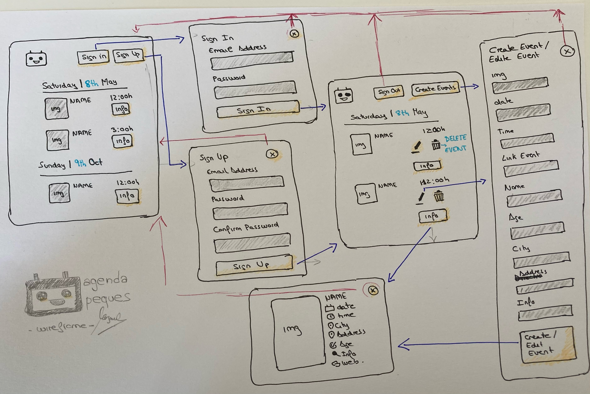
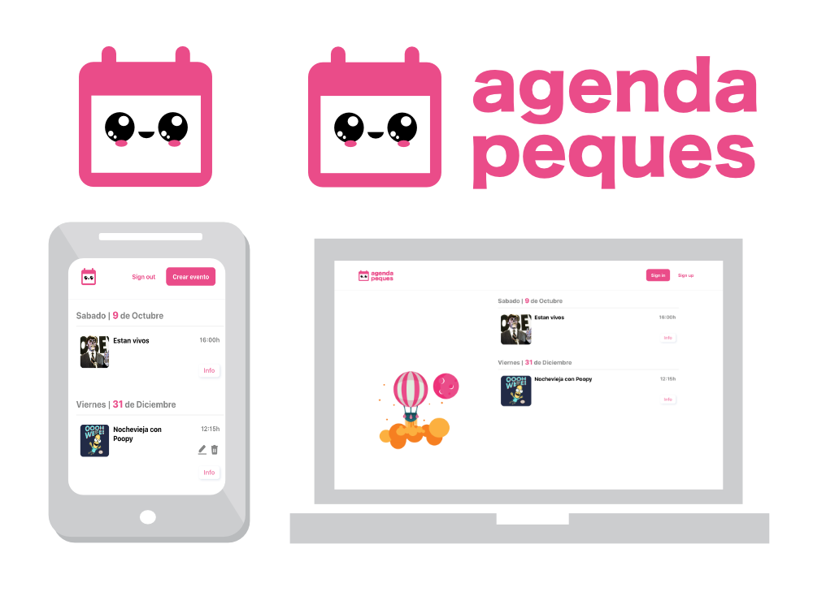
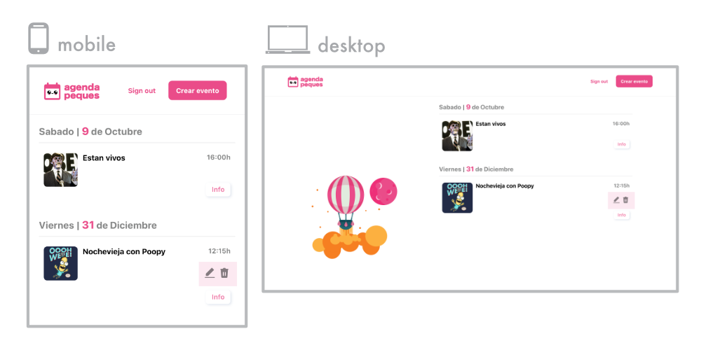
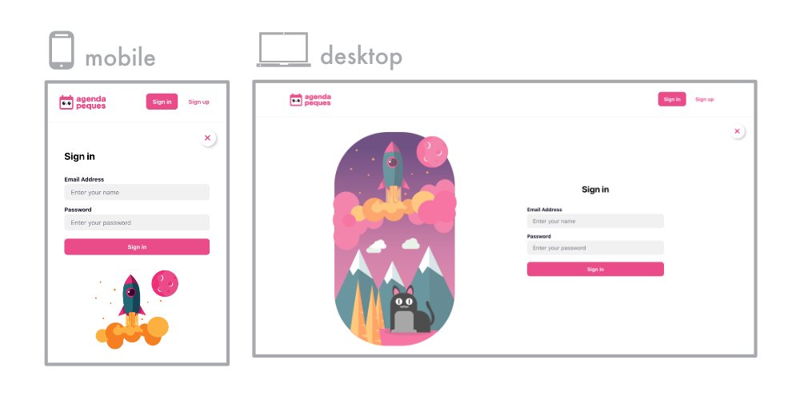
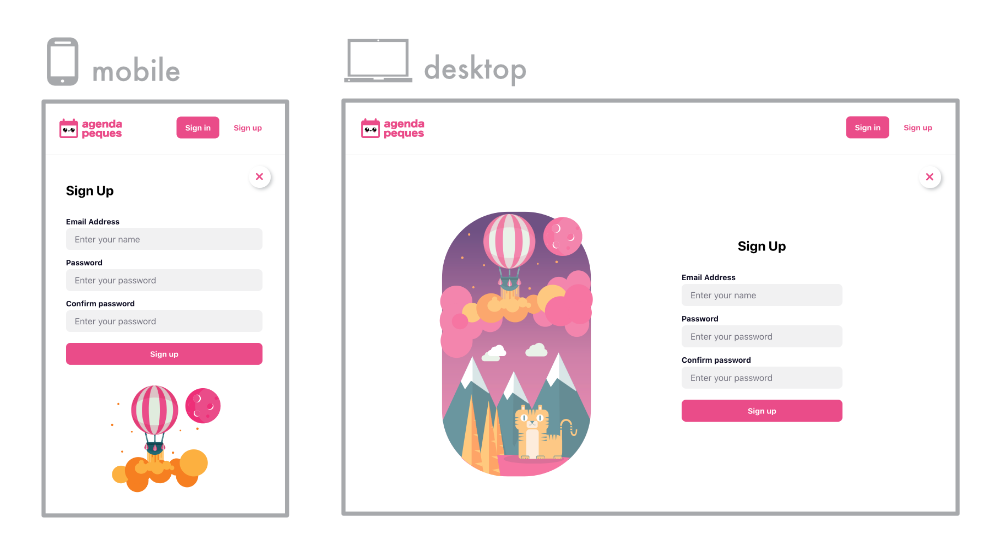
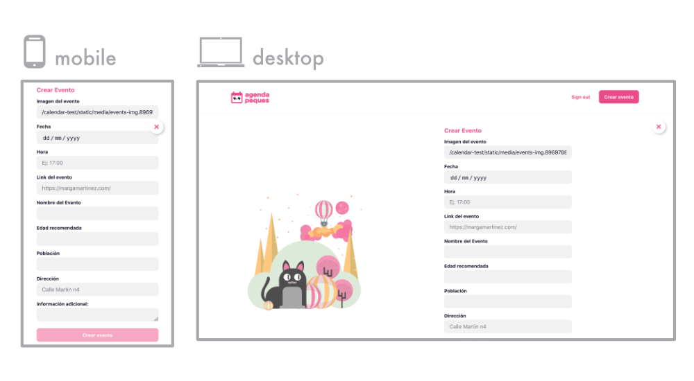
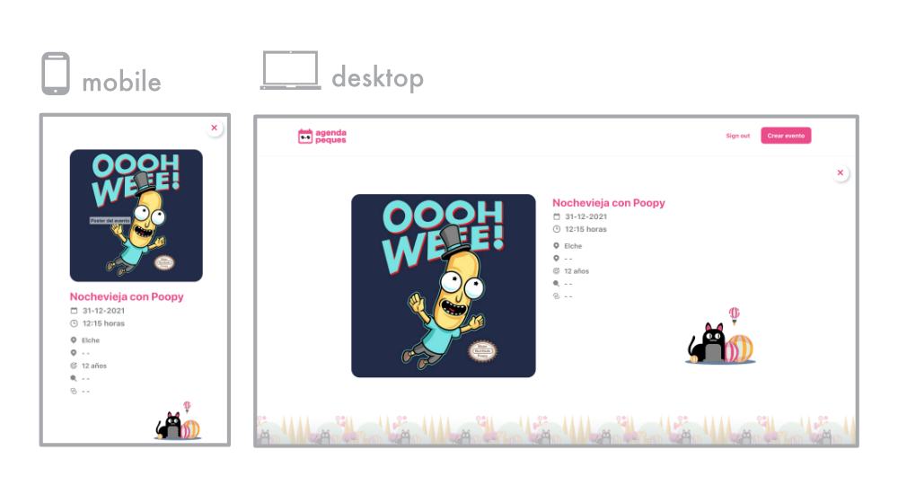
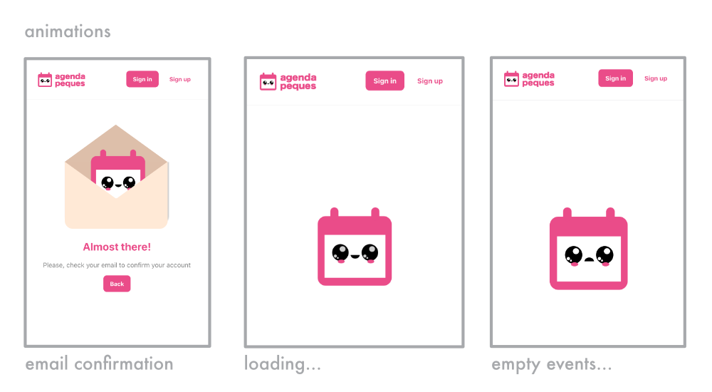
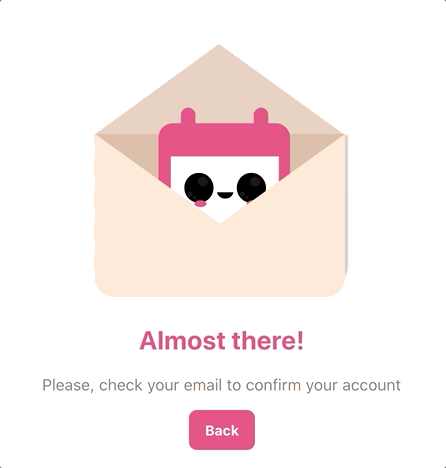
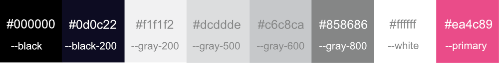

# Calendar App

A calendar app I created from scratch (well, with the help of create react app 😅) to improve my react and javascript. Also designed all of the user interface, did the illustrations and integrated it with supabase as a backend.

The app is an event list where users can register and create events, unregistered users will be presented with a list of upcoming events. The idea was to keep it as simple as possible in order to learn the technologies well, but also create something usable in production.

## Learning objectives when making this app 👩🏻‍🎓

This was a very ambitious app, when presented with the idea I decided to go for it cause it will help me reach some objectives related to my education as a frontend developer, and show/improve my design skills.

The objectives I set for myself were:

- Designing a calendar/event list app, that is user friendly, to show and improve my **UX/UI design skills**.
- Sorting all the information needed to develop the app into **reusable components**.
- Understanding supabase and how it is used. Supabase has great user design, so it simplifies the **backend** and I can understand backend concepts better.
- Separating **api calls into its own module/layer** in order to decouple the view from the api, so it should be simple to switch to a different backend if needed.
- Use react-router to handle all of the **navigation on the client**.
- Making design **responsive** in order to show/improve my CSS.
- Creating a **consistent brand** through the app, to show how I can take advantage of my experience as a designer.

## Wireframe design 🤓

I always start with a wireframe of the project to get a general idea of what I want to include and the user flow. I like doing it on paper, I don't use a computer to avoid temptation to include decoration (like colors) and focus on the user flow and features needed.

## Technologies used 👩🏻‍💻

- React
- React Router
- HTML
- CSS
- Supabase

## Responsive design 👩🏻‍🎨

Next I started crafting the views and components directly in the browser using CSS, I prefer this to using a design app, cause it allows me to experiment better with how things are viewed at different screen sizes.

Elements like the logo and illustrations were created using Affinity Designer and exported as SVGs.

### Logo
I created two versions of the logo with text and without to adapt to different screen sizes.

### Home screen
This component shows all the events. The events that belong the authenticated user have the option to delete and edit them.

At first I thought of making a calendar view so the user could click on any day and see events for that day, but this was harder to implement and after thinking about how a user would use the app I realized, that they would prefer to see a list of upcoming events, without having to click several times on each day. So making this a list was a win/win.

### Sign in component
    
I created two diffents illustrations to use at different viewports. The feature is as simple as it gets, the auth is powered by supabase.

### Sign up component

Also with two different illustrations depending on the viewport. This is asking a user the minimal possible data to avoid friction to sign up. The email then must be confirmed, this feature is also provided by supabase, but I created a view to inform the user to check for the email confirmation. The view has a small animation to make it more playful, there's as a gif included down below that shows it.

### Create event and event information

I reused the same view for editing and creating event, the trick was to make react router check if an existing event id is pased as a URL param, if it is included we call the API for the event details and populate the form with the event details, if no id is passed we show the component in "create mode". Then depending on this id, we call the api for creating (if no id is present) or updating (if the url contains an id).

## CSS Animations 👩🏻‍🎤

There are 3 states when the app is fetching. It can be fetching data, already fetched events, and alrady fetched but with no events returned(empty).

I did a couple svg animations, one for those loading states and another for the email confirmation screen, I love putting those kind of small details that help give the app personality.

Email confirm animation.

Loading animation.

Empty events animation.

## Colors 🌈
 
I always start designing in black and white. It's the best option to get a sense of balance and rhythm in a design. Then I make a color palette depending on the target. I prefer small color palettes to keep the design more consistent and elegant.

## Available Scripts

This was scaffolded using [create react app](https://github.com/facebook/create-react-app), so you can check their project for more info

Below I put a list of the most useful scripts included for quick reference:

### `npm start`

Runs the app in the development mode.\
Open [http://localhost:3000](http://localhost:3000) to view it in the browser.

The page will reload if you make edits.\
You will also see any lint errors in the console.

### `npm run build`

Builds the app for production to the `build` folder.\
It correctly bundles React in production mode and optimizes the build for the best performance.

